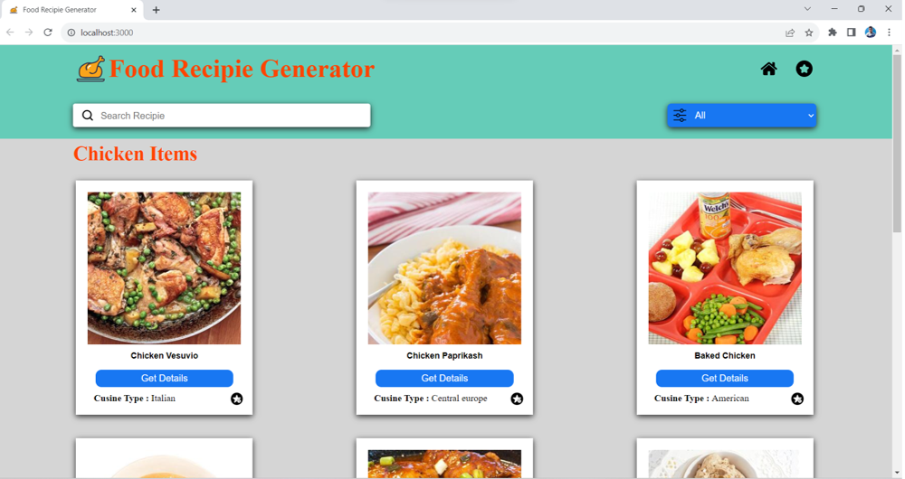
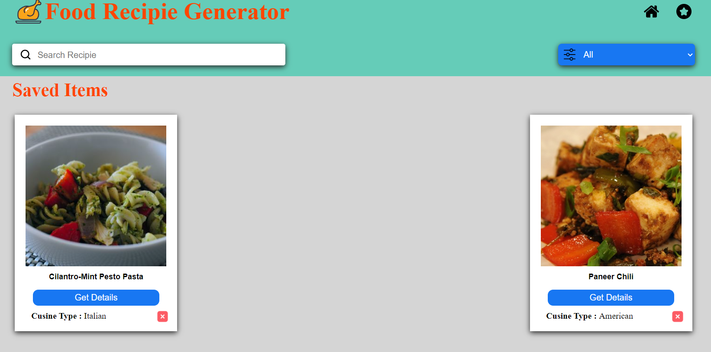
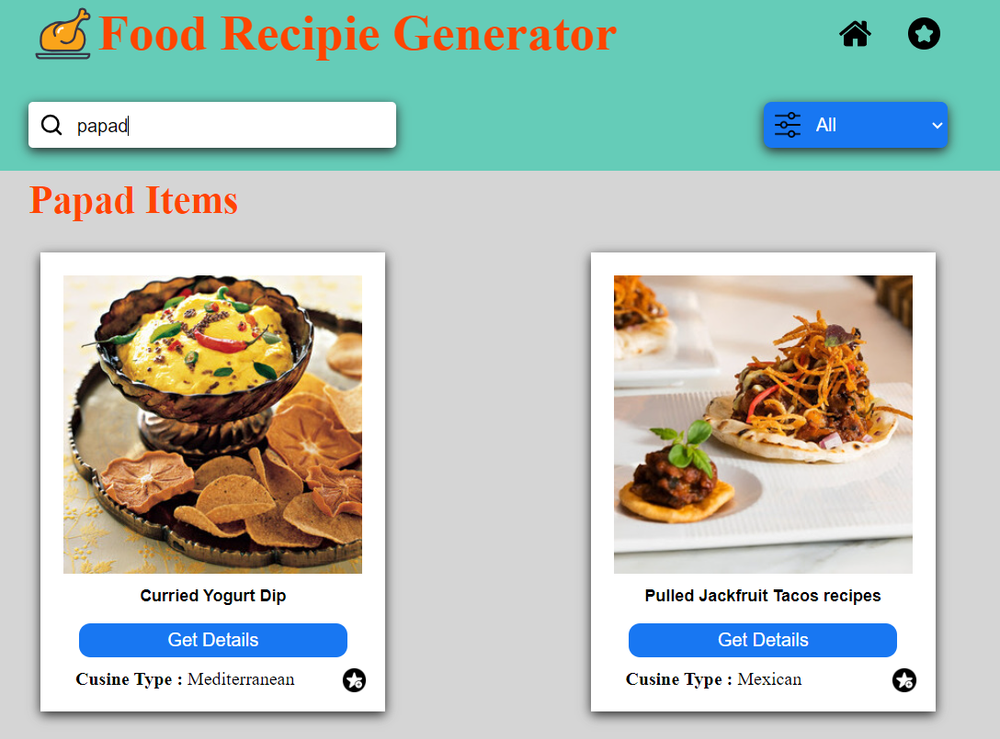

<br/>
<p align="center">
  <a href="https://github.com/bhuvan-bhu1/Food-Recipe-Generator">
    
  </a>

  <h3 align="center">Food Recipe Generator</h3>

  <p align="center">
    An Awesome application to find best recipies
    <br/>
    <br/>
    <a href="https://drive.google.com/drive/folders/1gV2zvTFH-e0Ej3tHeU9pCMiSjl8TYNd7"><strong>Explore the docs »</strong></a>
    <br/>
    <br/>
    <a href="https://bhuvanfoodrecipieapp.netlify.app/">View Demo</a>
    .
  </p>
</p>

  

## Table Of Contents

* [About the Project](#about-the-project)
* [Built With](#built-with)
* [Getting Started](#getting-started)
  * [Prerequisites](#prerequisites)
  * [Installation](#installation)
* [Usage](#usage)
* [Authors](#authors)
* [Acknowledgements](#acknowledgements)

## About The Project



A food recipe generator is a versatile and innovative tool designed to provide culinary inspiration and guidance to both novice and experienced cooks.

Wheather you are seaking for the best recipies for making good dish this application helps you with better available options for your search.

Include a diverse range of global cuisines and recipes, allowing users to explore and experience different culinary traditions and flavors. 

The recipe suggestions to individual user preferences, including cuisine type,ingredient required and step by step instructions. 


## Built With

This project is build with web development and mostly used softwares are

* [React](https://react.dev/)
* [React bootstrap](https://react-bootstrap.netlify.app/)
* [Javascript](https://www.javascript.com/)
* [HTML5](https://html.com/)
* [CSS3](https://www.w3.org/Style/CSS/Overview.en.html)

## Getting Started

To Run the application in the local server user should install all the prerequisites. 

### Prerequisites

Install npm(Node Package Manager) from official website 

* npm

Check npm is Installed

```sh
npm --version
```

### Installation

1. Clone the repo

```sh
git clone https://github.com/bhuvan-bhu1/Food-Recipe-Generator.git
```
2. Install NPM packages

```sh
npm install
```

## Usage

After installing all the prerequisites now run the below command in the terminal to run the react application in local server

```sh
npm start
```

Open the application in your favourite browser 
Some screen shots of the application
1. Saved Recipies


2.Search Recipie Option


## Authors

* **D V BHUVANESH** - *Computer Science Student* - [D V BHUVANESH](https://github.com/bhuvan-bhu1/) - *Build the whole project*

## Acknowledgements

* [React Bootstrap](https://react-bootstrap.netlify.app/)
* [React ](https://react.dev/)
* [Flaticons](https://www.flaticon.com/)
